## Final Project Journal

### Apr 3

We finalized (almost) our idea for the final project and drew initial sketches for the mechanisms we decided to incorporate in our project.
The mechanisms include the following:

- A pulley mechanism for the moving backdrop
- A mechanism to keep the first falcon flying and flapping its wings: possibly a cam mechanism or a mechanism like this.
- A mechanism to make the second falcon dive in.
- A mechanism to make it appear as if the second falcon has caught a prey upon reaching closer to the herd of the preys: the pop-up mechanism that makes the prey appear from the behind the falcon at the right time to make it seem like the falcon caught the prey.

If we have time in the end, we may add the following mechanisms:

- A cam mechanism making the preys hop.
- A curtain mechanism to hide the resetting of the scene.

#### Sketches

Screen and Flying Falcon

Diving Falcon and Prey Mechanism

### Apr 7

We made our first protoype for the flying falcon mechanism and we did measuring / figured out how to layout all the mechanism of our final project that proper fit within the box. 

The protoype was for the flying mechanism for the flacon which would move up and down in front of the screen while flapping its wings. The protoype was made from more cheaper materials so that we could make the mechanism faster and see what works and what does not.

Materials Used:

- Fishing Line
- Cardboard
- Small Metal Hooks 
- Wooden Stick

#### Flying Falcon Protoype

#### What Did We Learn

The protoype did not work as we intended even though we followed majority of the steps for its recreations from online sources. We believe the problems lied in the material and size of the materials the protoype was created from. The size of the metal hooks compared to the size of the bird it too big and puts the wings too far apart from the body to allow the bobbing motion to take place. The cardboard it too light compared to wood. This prevented proper tension from taking place which in turn didnt allow the fishing line's flexibility to pull the bird up and down. Lastly the protoypes wings are not properly aligned and are not identical. This makes the weight unbalanced and makes the up and down movement not possible.

#### Layout Within Box

We also used the box in the workshop to refine the layout for the final project.

### Apr 8

We also made a Fusion 360 prototype of the slider mechanism, which we plan to use in order to make the prey pop out from behind the diving falcon to make it appear as if the falcon has caught it. In the first prototype of this mechanism made from cardboard (the one where a shell was made to pop out onto the diver’s hand), the mechanism itself was very huge and took up a lot of space. We wouldn’t have that much space in our final project, hence, we needed to make it compact enough (and also flat enough) so that it fits properly behind the falcon. 

The prototype that can be seen in the images below is 10 cm long and 1.5 cm thick. This is a huge decrease in the size of the mechanism. The prototype is currently only simulated in Fusion 360. We plan to laser cut the different parts of this mechanism separately based on the measurements in Fusion 360 and assemble them later to build the mechanism in real.

#### Prototype Images

https://user-images.githubusercontent.com/57341178/230861094-e4a45999-0a9e-4592-913d-b28c6797051b.mov

### Apr 14

Today we worked on 3D printing the slider mechanism that we designed earlier in Fusion 360. The slider mechanism will be used to make the prey pop out from behind the diving falcon to give the appearance of the falcon catching it. We used hot glue to test the mechanism and it works fine as shown below. However, for the final permanent join, we plan to use super glue.

##### Slider Mechanism Images

#### Slider Mechanism Video

https://user-images.githubusercontent.com/25387553/233049816-8a23d0f5-b4f5-4235-97d7-9f9ed88008eb.mov

### Apr 17

We worked on extending the height of the backdrop for our final project. We measured the box and made an aluminum frame that is 50cm in height. The extended height will provide more space for the pulley mechanism that will be used to move the backdrop. 

#### Backdrop Extension Images and Video

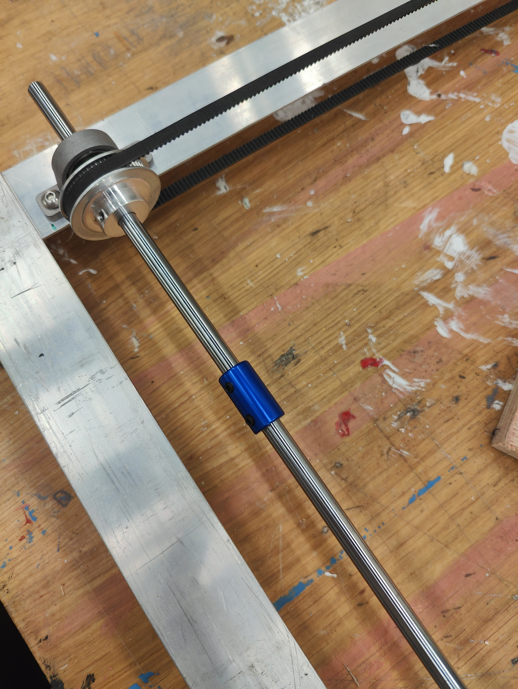

https://user-images.githubusercontent.com/57341178/233063391-dadcdf03-b011-4457-b29e-0dbeaaa5a317.mp4

### April 24

We used 3D printing to make the falcon for our diving mechanism. Once we had the bird printed, we attached it to the prey mechanism that we printed earlier and tested to see if the pop out mechanism works well. We realized that the bird is a bit smaller to hide the the prey properly. We could still see some parts of the mechanism hidden behind and therefore, we decided to print a bigger bird for the final version.

#### Prey Mechanism Attached to the Falcon

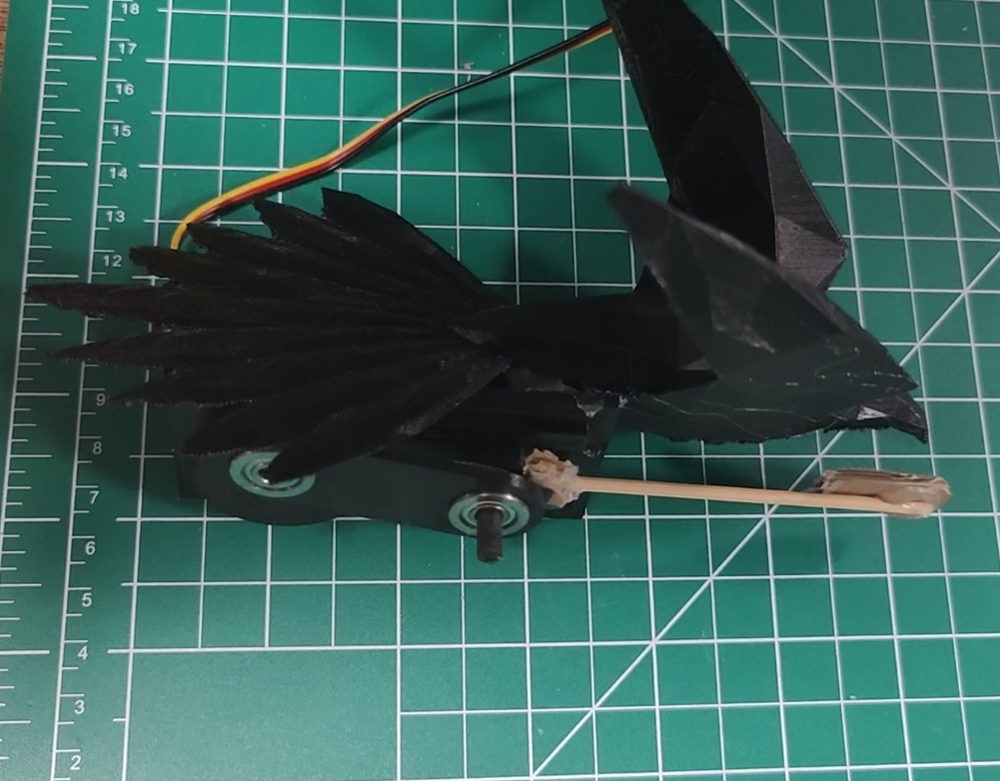

https://github.com/yashaswiim/machineLab_finalProject/assets/57341178/3a1889e7-a904-4f80-8cdb-7bfa7273007c

### April 29

Today we worked on measuring and cutting wood for our bases (the actual one as well as the false one). We decided to keep a sturdy base at the bottom of the cube and place all our mechanisms on top of it including the arduino, all the motors and the wires. We then decided to use a thinner piece of wood to cover these mechanisms and place it as the false base of the cube. We also decided to add decorations on top of this false base to make it look like the desert so that it goes well with our theme. Once we had our bases, we also finalized where we want each of our mechanisms to go within the cube. 

#### Base Image

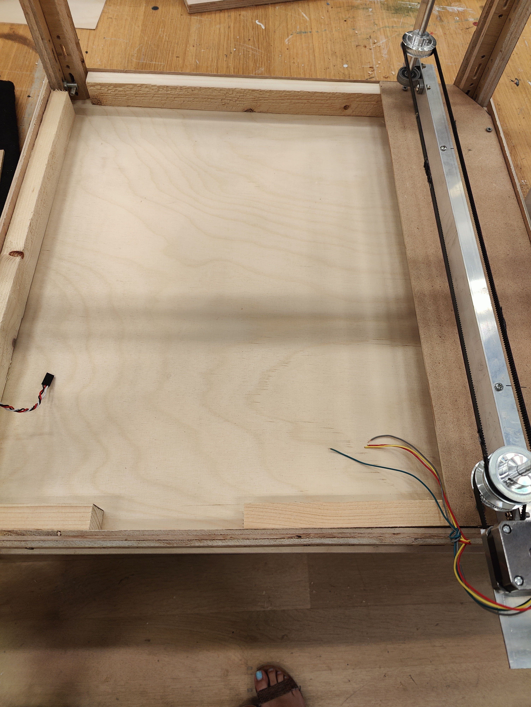

Initially we wanted to go with the idea of having two DC motors wind and unwind a thread to make the bird dive from a higher position to a lower position in the cube. We then realized that idea of using the DC motors was highly likely to fail because the thread would not be able to carry the weight of the falcon and the prey mechanism attached to it. So, we decided to use a giant servo and attach it to the falcon using a sturdy wooden bar. We were worried about how it would look to have a wooden bar attached to the falcon but upon consulting with our professor and some other peers, we decided that it might as well be good sometimes to let the audience see what is going on behind the mechanism. So, we decided to keep the servo and the wooden bar that attaches the bird to the motor visible to the viewers. After that we also fit our diving bird to the large servo to test how it would look.

#### Servo and Falcon Placement Image

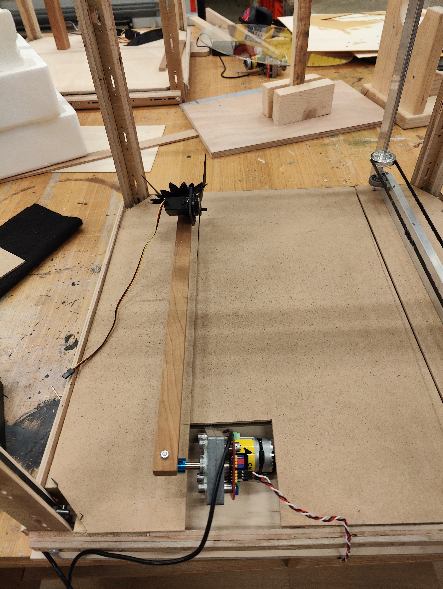
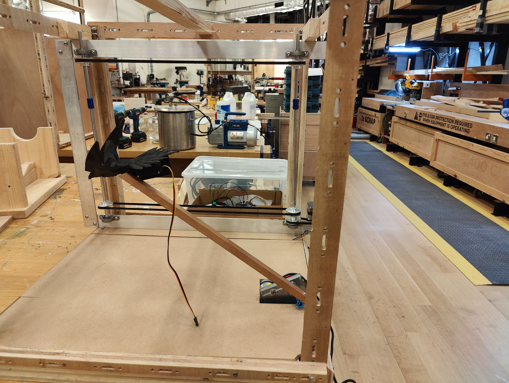

Along with the looks, we also tested if it would work as we had planned. We wrote the code to make the bird dive when a button is pushed and then pop out and pop in the prey at appropriate times, depending on the position of the diving bird. Below is a video and some images of the mechanism working.

#### Diving Falcon Mechanism Images and Video

https://github.com/yashaswiim/machineLab_finalProject/assets/57341178/a4fe67a4-f10c-44e2-b49a-66028274bd22

### May 1

Today we worked on making the flapping falcon mechanism. We followed along a YouTube video to make the bird and after a lot of struggle with cutting it accurately, finding its center of gravity and attaching all its parts such that it flaps properly, we got it working. We finally used laser cutter to cut the parts of the bird. It is a design we found online and is of a seagull. We plan to paint and decorate it to make it look like a falcon for our theme.

#### Flapping Bird Mechanism Images

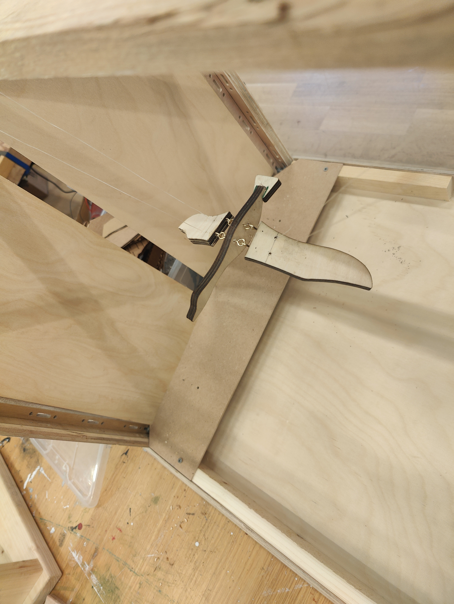
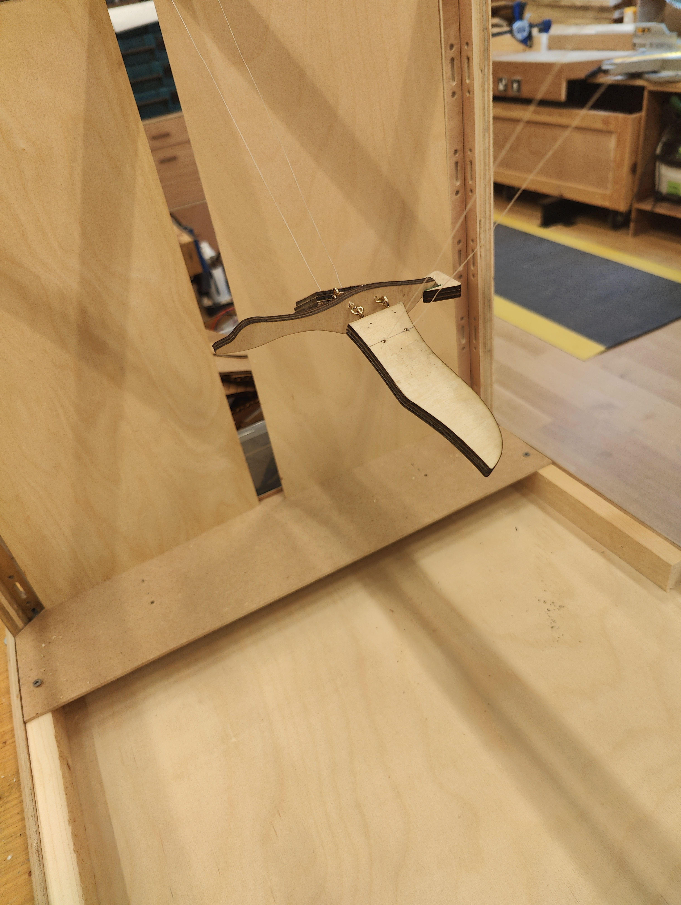

https://github.com/yashaswiim/machineLab_finalProject/assets/57341178/4c03b590-8745-4ebf-980b-350506256f1b

### May 3

We worked on the background mechanism today. We had the background printed from our university library on a matte inkjet paper (those that are used to print posters on). Initially we decided to stick the background directly on the belts of the pulley mechanism. However, it was not a very good idea. At the turning points, the background always came off. Then we decided to use a cloth as it would give some flexibility while turning. Finally, we pasted the background on a long piece of cloth, then attached that cloth to the belt. It still came off from some places, but the mechanism worked fine enough when we tested it with the motor for quite some time.

#### Background Mechanism Images and Video

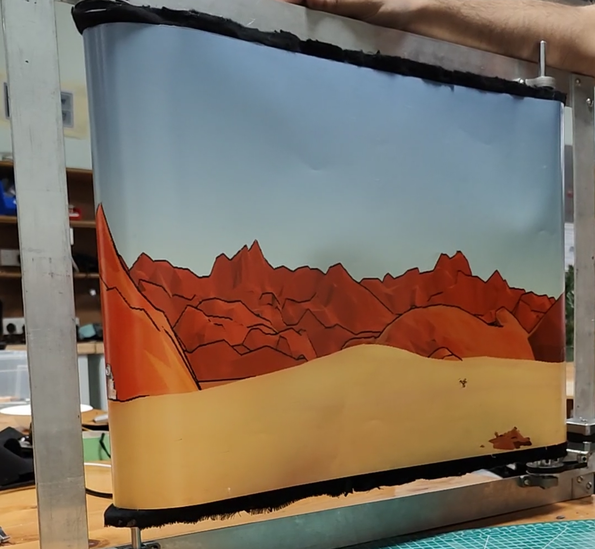

https://github.com/yashaswiim/machineLab_finalProject/assets/25387553/02e7bce3-d4d7-485a-ba4b-cc27060b3d95

https://github.com/yashaswiim/machineLab_finalProject/assets/57341178/3820d16c-3b68-4e1e-bc2c-5fe346bafe96

### May 4

We reprinted the falcon and the prey mechanism since the last time we tested it, we found the previous version to be a bit smaller to hide a whole prey behind. This is how the mechanism looks now:

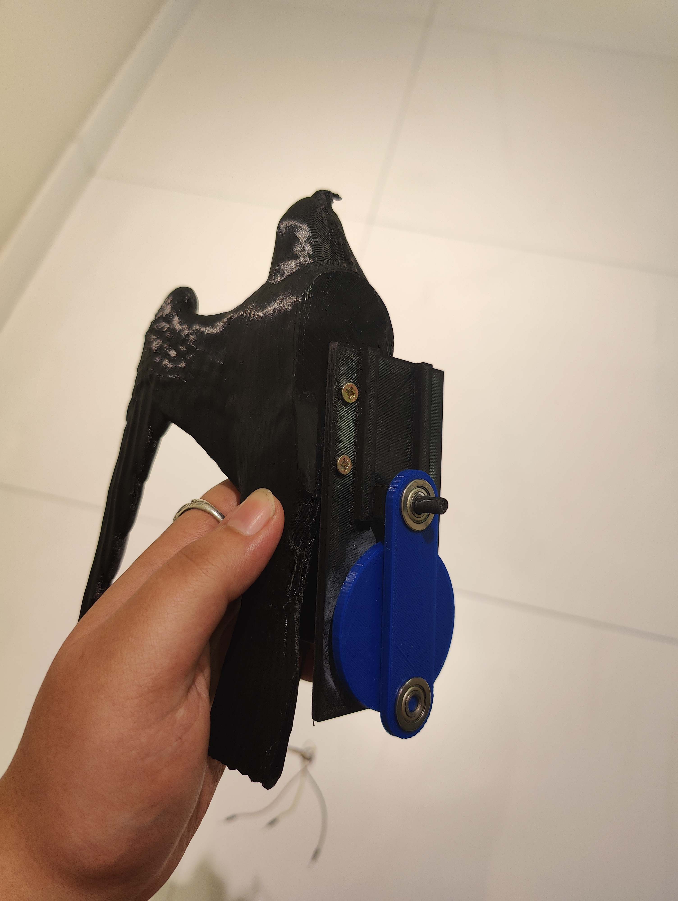

We also changed the body of the flapping falcon so that it looks more like a falcon than a seagull. We used one of the falcons we printed earlier for the diving mechanism to replace the body since we printed a larger falcon for the diving mechanism itself.

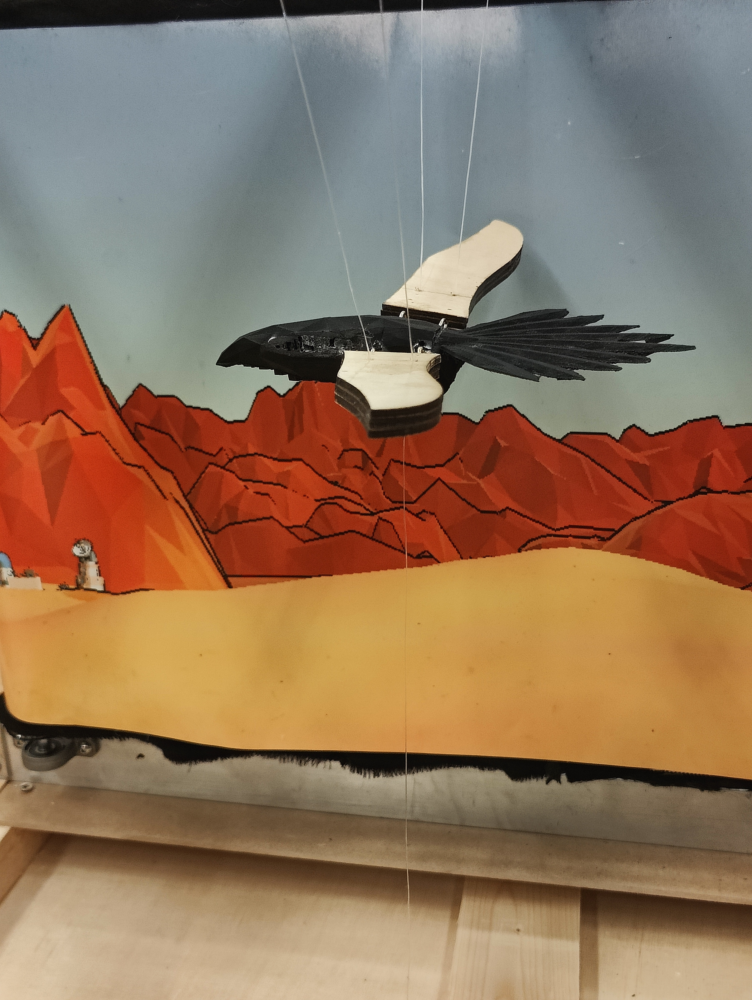

### May 7 

We worked on attaching a motor for the flapping bird mechanism. We initially had planned to use a servo motor. However the speed of the servo motor was not satisfactory and convincing enough to make it look like the bird was flapping its wings. We needed a faster motor and therefore, decided to use a DC motor. Since DC motors give rotational movement and we cannot control its angle like we can for the servo motor, we had to use another slider mechanism to convert its rotational movement into up and down linear movement. To control its speed, we then used an H-bridge.

We finally put together all three of our mechanisms, physically and in code, to see how they work together.

https://github.com/yashaswiim/machineLab_finalProject/assets/57341178/fb11eb23-2c34-4873-a68b-7fd5c6ba1126

### May 8

We painted our falcons to make them look more real and also laser cut some desert mountains to add to our cube for aesthetic purposes.

#### Painted Falcon Images

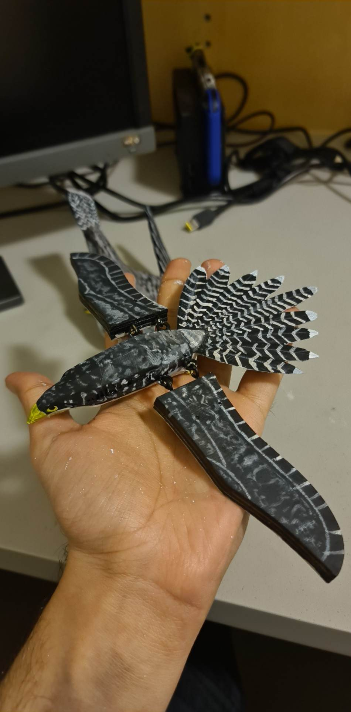
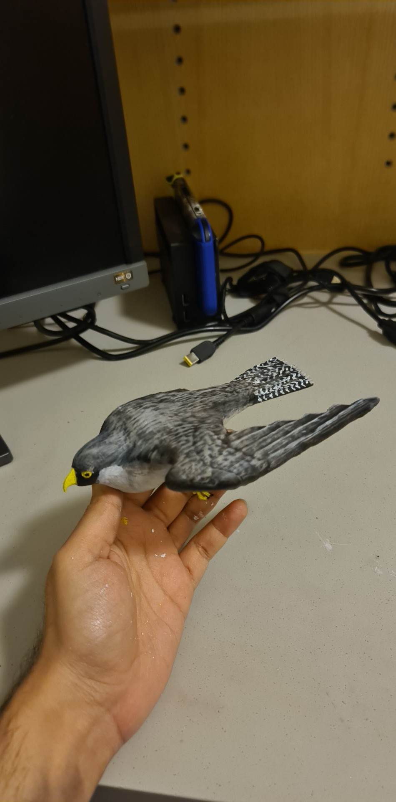

### May 10 

We worked on writing the code and assembling the project. Additionally, also worked on the finalizing the asthestics of the project. For the code, we needed to make sure that the mechanism started when it received the signal from the master clock and then sent a signal back once the mechanism was done. We also had figure out ways to delay some mechanisms without actually using the delay() function of arduino so that it wouldn't mess up with receiving and sending the signals.

We also soldered protyping shields for arduino and connected wires for power, signal and ground.

### May 11: Final Day 

We did some last minute fixing to the aesthetics and the code.

WE HAVE THE MECHANISM UP AND RUNNING. YAY!

https://github.com/yashaswiim/machineLab_finalProject/assets/25387553/3025f90d-a511-491b-9160-2d93f0b844da
