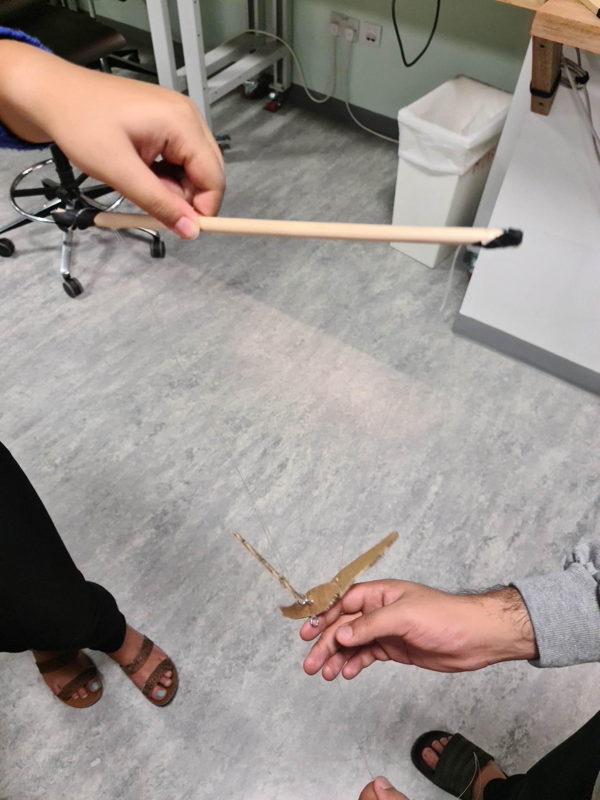
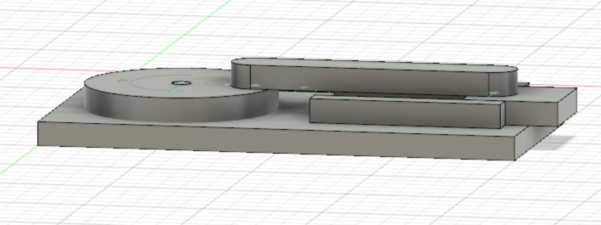

## Final Project Journal

### Apr 3

We finalized (almost) our idea for the final project and drew initial sketches for the mechanisms we decided to incorporate in our project.
The mechanisms include the following:

- A pulley mechanism for the moving backdrop
- A mechanism to keep the first falcon flying and flapping its wings: possibly a cam mechanism or a mechanism like this.
- A mechanism to make the second falcon dive in.
- A mechanism to make it appear as if the second falcon has caught a prey upon reaching closer to the herd of the preys: the pop-up mechanism that makes the prey appear from the behind the falcon at the right time to make it seem like the falcon caught the prey.

If we have time in the end, we may add the following mechanisms:

- A cam mechanism making the preys hop.
- A curtain mechanism to hide the resetting of the scene.

#### Sketches

Screen and Flying Falcon

Diving Falcon and Prey Mechanism

### Apr 7

We made our first protoype for the flying falcon mechanism and we did measuring / figured out how to layout all the mechanism of our final project that proper fit within the box. 

The protoype was for the flying mechanism for the flacon which would move up and down in front of the screen while flapping its wings. The protoype was made from more cheaper materials so that we could make the mechanism faster and see what works and what does not.

Materials Used:

- Fishing Line
- Cardboard
- Small Metal Hooks 
- Wooden Stick

#### Flying Falcon Protoype

#### What Did We Learn

The protoype did not work as we intended even though we followed majority of the steps for its recreations from online sources. We believe the problems lied in the material and size of the materials the protoype was created from. The size of the metal hooks compared to the size of the bird it too big and puts the wings too far apart from the body to allow the bobbing motion to take place. The cardboard it too light compared to wood. This prevented proper tension from taking place which in turn didnt allow the fishing line's flexibility to pull the bird up and down. Lastly the protoypes wings are not properly aligned and are not identical. This makes the weight unbalanced and makes the up and down movement not possible.

#### Layout Within Box

We also used the box in the workshop to refine the layout for the final project.

### Apr 8

We also made a Fusion 360 prototype of the slider mechanism, which we plan to use in order to make the prey pop out from behind the diving falcon to make it appear as if the falcon has caught it. In the first prototype of this mechanism made from cardboard (the one where a shell was made to pop out onto the diver’s hand), the mechanism itself was very huge and took up a lot of space. We wouldn’t have that much space in our final project, hence, we needed to make it compact enough (and also flat enough) so that it fits properly behind the falcon. 

The prototype that can be seen in the images below is 10 cm long and 1.5 cm thick. This is a huge decrease in the size of the mechanism. The prototype is currently only simulated in Fusion 360. We plan to laser cut the different parts of this mechanism separately based on the measurements in Fusion 360 and assemble them later to build the mechanism in real.

#### Prototype Images

https://user-images.githubusercontent.com/57341178/230861094-e4a45999-0a9e-4592-913d-b28c6797051b.mov

### Apr 14
Today we worked on 3D printing the slider mechanism that we designed earlier in Fusion 360. The slider mechanism will be used to make the prey pop out from behind the diving falcon to give the appearance of the falcon catching it. We used hot glue to test the mechanism and it works fine as shown below. However, for the final permanent join, we plan to use super glue.

##### Slider Mechanism Images

<!--   
   -->

#### Slider Mechanism Video

https://user-images.githubusercontent.com/25387553/233049816-8a23d0f5-b4f5-4235-97d7-9f9ed88008eb.mov

### Apr 17
We worked on extending the height of the backdrop for our final project. We measured the box and made an aluminum frame that is 50cm in height. The extended height will provide more space for the pulley mechanism that will be used to move the backdrop. 

#### Backdrop Extension Images

<!-- 

 -->

https://user-images.githubusercontent.com/57341178/233063391-dadcdf03-b011-4457-b29e-0dbeaaa5a317.mp4

